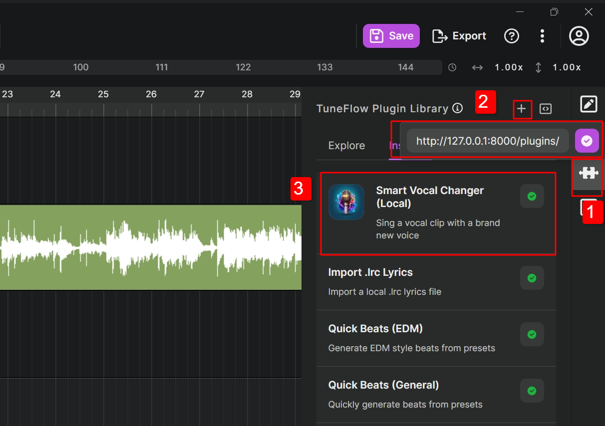

# so-vits-SVC Plugin for TuneFlow

[简体中文](./README.zh.md) | [English](./README.md)

## Clone Repo

```bash
git clone https://github.com/tuneflow/so-vits-svc-plugin.git
```

## Installation

### (Option 1) Download Pre-Built Release

You can also download a prebuilt package with all dependencies included, from the below links:

[Download for Windows](https://plugin-dist.tuneflow.com/plugins/binary/svc_local/win-x64-1.0.0.zip)

[Download for macOS (Coming Soon)](#)

### (Option 2) Build from Source

It is recommended to install through python virtual environments, so that these dependencies won't conflict with your existing pip packages.

```bash
pip install -r requirements.txt
```

In addition, you need `ffmpeg` to convert non-wave audio files to wave for the model to process. To install `ffmpeg`, follow the instruction [here (windows)](https://phoenixnap.com/kb/ffmpeg-windows) or [here (ubuntu)](https://phoenixnap.com/kb/install-ffmpeg-ubuntu) or [here (macOS)](https://phoenixnap.com/kb/ffmpeg-mac).

## (Optional) Automatically Load Models

If you want the plugin to load models on start up, you can optionally place your model file(.pth) and config file(config.json) under `checkpoints` folder.

The folder structure would look like this:

```
-- <root folder of the project>
    -- ......
    -- checkpoints
        -- G_XXX.pth
        -- config.json
    -- ......
```

## Run the Plugin

### If You Downloaded Pre-built Release

Unzip the app, and run the `local_app.exe` from the extracted folder.

### If You Built from Source

Once you installed the dependencies and prepared the models, you can start running the plugin using:

```bash
python local_app.py
```

Once started, you should be able to see something like this:

```bash
============= Plugin Info =============
Provider ID: andantei
Provider Name: Andantei
Plugin ID: singing-voice-clone-local
Plugin Name: Singing Voice Clone (Local)
Plugin Description: Sing a vocal clip with a new voice
=======================================
```

Next, start TuneFlow Desktop, if you don't have it already, download from the homepage [https://tuneflow.com](https://tuneflow.com).

Create an empty song, or open an existing song.

Once the project is loaded, switch to the TuneFlow Plugin Library, at the top right corner, click on the "Load a remotely hosted plugin" button. And paste http://127.0.0.1:8000/plugins/singing-voice-clone-local into the address input. If everything is setup correctly our plugin should load successfully and show up in the plugin inventory.



To run the plugin, right click on a vocal clip, in the run plugins menu, select this plugin.
