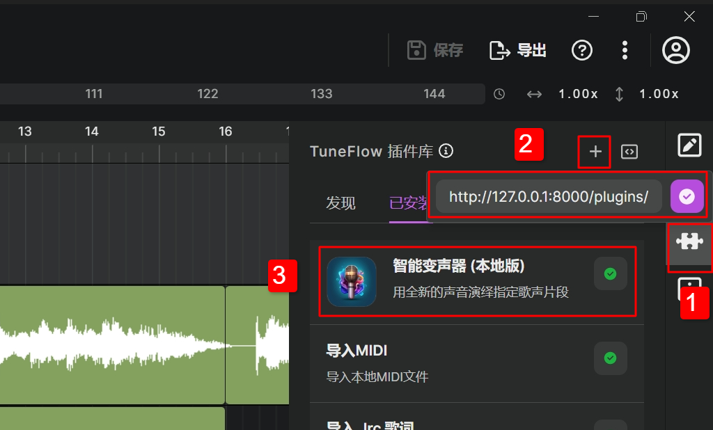

# so-vits-SVC TuneFlow 插件

[简体中文](./README.zh.md) | [English](./README.md)

## 下载代码

```bash
git clone https://github.com/tuneflow/so-vits-svc-plugin.git
```

## 安装依赖

注意：安装python依赖包时推荐使用virtualenv，这样可以将插件所需依赖与系统其他依赖分离开来。

```bash
pip install -r requirements.txt
```

## 训练自己的模型

参考 [炼丹百科全书](https://docs.qq.com/doc/DUWdxS1ZaV29vZnlV)，有非常易用的网页版训练界面。

## 准备模型

模型文件放置在 `checkpoints` 文件夹，以下是一个可能的文件结构：

```
-- so-vits-svc-plugin
    ......
    -- checkpoints
        -- my_model_1
            -- config.json
            -- G_20000.pth
            -- kmeans_1000.pt
        -- another_model
            -- another_config.json
            -- G_40000.pth
            -- kmeans_10000.pt
        -- third_model
            -- some_config.json
            -- G_30000.pth
    ......
```

这个例子中有三个模型，分别放置在`my_model_1`, `another_model`, `third_model`文件夹下。

放置完模型后，我们需要在插件根目录创建一个 `models.json` 文件。这个文件中包含了所有的模型的描述信息和模型文件的位置。它的内容是一个模型描述的列表，每一项包含以下信息：

- `id` 模型ID，可以填写任何独一无二的字符串
- `name` 会在UI中显示的模型名称
- `dir` 模型文件夹的名字，注意只需要填写文件夹本身的名称，不需要包含完整路径
- `config` 模型config文件(.json)的名称，只需要填写config文件本身的名称，不需要填写完整路径
- `model` 模型文件(.pth)的名称，只需要填写文件本身的名称，不需要填写完整路径
- `cluster` 聚类文件(kmeans_XXXX.pt)的名称，只需要填写文件本身的名称，不需要填写完整路径。如果没有聚类文件，则不用填写。
- `cluster_name` (选填) 聚类名称 (一般是类似 kmeans_10000.pt 的值) (如果没有聚类模型则忽略此项)
- `model_branch` (选填) 模型分支名称 (不填则视为"v1")
- `hifigan_enhance` (选填) 是否启用hifigan来改进小样本模型 (不填则视为false)

对于上述例子中的目录结构，我们会有一个类似这样的 `models.json`:

```json
[
    {
        "id": "model_1",
        "name": "Pop Star",
        "dir": "my_model_1",
        "config": "config.json",
        "model": "G_20000.pth",
        "cluster": "kmeans_1000.pt"
    },
    {
        "id": "model_2",
        "name": "Rock Singer",
        "dir": "another_model",
        "config": "another_config.json",
        "model": "G_40000.pth",
        "cluster": "kmeans_10000.pt"
    },
    {
        "id": "model_3",
        "name": "Jazz Voice",
        "dir": "third_model",
        "config": "some_config.json",
        "model": "G_30000.pth"
    }
]
```

创建完毕后，整体的目录结构会是这样的:

```
-- so-vits-svc-plugin
    ......
    -- models.json
    -- checkpoints
        -- my_model_1
            -- config.json
            -- G_20000.pth
            -- kmeans_1000.pt
        -- another_model
            -- another_config.json
            -- G_40000.pth
            -- kmeans_10000.pt
        -- third_model
            -- some_config.json
            -- G_30000.pth
    ......
```

## 运行插件

当python依赖和模型文件准备完毕后，我们可以开始跑起来插件了。用以下命令运行插件:

```bash
python debug.py
```

插件正常运行的情况下，你可以看到类似下面的控制台输出：

```bash
============= Plugin Info =============
Provider ID: andantei
Provider Name: Andantei
Plugin ID: singing-voice-clone
Plugin Name: Singing Voice Clone
Plugin Description: Sing a vocal clip with a new voice
=======================================
```

接下来，启动 TuneFlow 桌面版。如果你还没有下载的话，可以从 TuneFlow 首页下载： [https://tuneflow.com](https://tuneflow.com)。

打开桌面版后，我们可以创建一首空白曲目，或者打开一首已有的曲子。

曲目加载完成后，在界面右侧切换到 TuneFlow 插件库。在插件库面板的右上角点击"加载本地待测试插件"按钮来加载我们刚启动的插件。如果所有东西配置正确的话，你应该可以看到插件被加载到了插件库中。




最后，我们可以在需要转换的音频片段上右键，在运行插件菜单中选择本插件运行。
